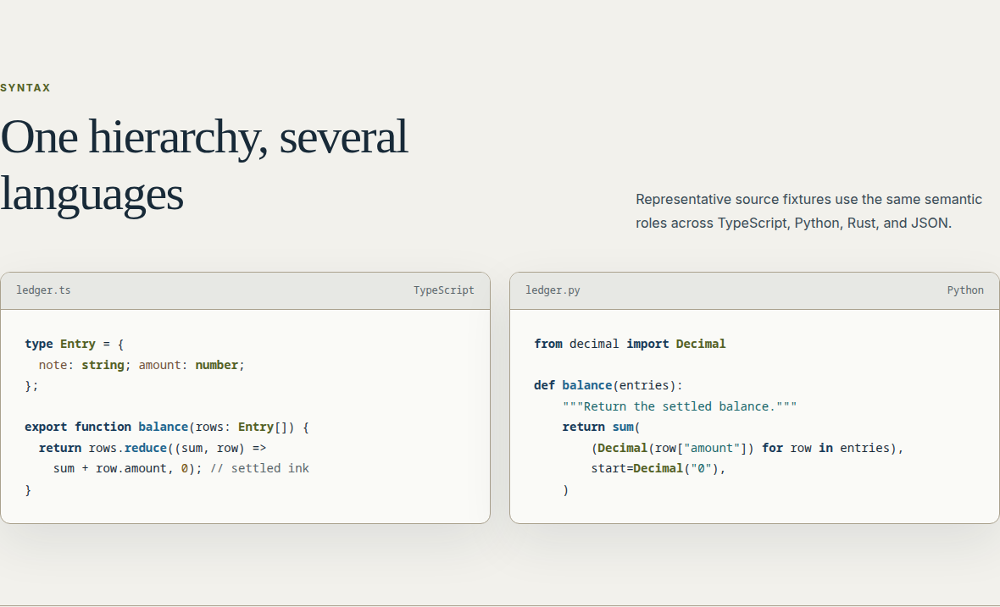
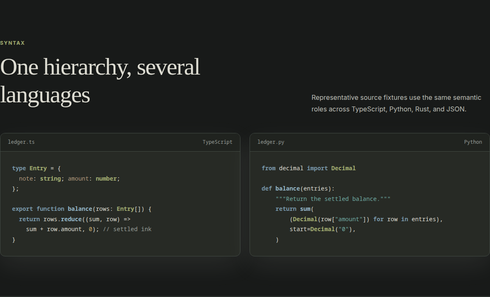

# `Nib` 🖋

Nib is a fountain-pen colour system for sustained reading, writing, and code.
Deep blue-black gives structure to cool-neutral paper, while soft ivory marks a
near-black chalkboard leaf; diluted washes and pooled accents carry interface
state without turning the page into a highlighter set.

Learn more in the [palette notes](docs/PALETTE.md) and
[blind preference audit](docs/BLIND_AUDIT.md).

## Syntax highlighting

Nib keeps prose calm and gives syntax a restrained hierarchy: blue ink for
structure and callable names, moss for types, teal for strings, and quieter
burgundy, rust, violet, amber, sepia, and graphite accents. Light and dark ports
share the same semantic roles rather than using unrelated palettes.




## Ports

Nib contains artifacts for the following apps and tools. “Available” does not
mean visually verified: consult the [support and evidence matrix](docs/SUPPORT.md)
for Generated, Verified, and Experimental tiers. Every bundled port is derived
from the locked semantic palette or the reviewed foundation ramps.

### Apps

- [Alacritty](alacritty/)
- [Black Box](black-box/)
- [Chrome and Chromium](chromium/)
- [Discord through BetterDiscord or Vencord](docs/MESSAGING.md#discord) — Experimental
- [Dunst](docs/DESKTOP.md#dunst)
- [GNU Emacs](docs/EMACS.md)
- [GIMP palette](docs/CREATIVE.md#gimp)
- [Firefox](docs/FIREFOX.md)
- [fish](fish/)
- [fzf](fzf/)
- [Ghostty](docs/GHOSTTY.md)
- [Helium](docs/HELIUM.md)
- [Helix](docs/HELIX.md)
- [i3](docs/DESKTOP.md#i3)
- [IntelliJ Platform IDEs](intellij/)
- [iTerm2](iterm2/)
- [Kitty](kitty/)
- [Konsole](docs/PORTS.md#konsole)
- [Lite XL](lite-xl/)
- [macOS Terminal](docs/PORTS.md#macos-terminal)
- [Matplotlib](docs/CREATIVE.md#matplotlib)
- [Neovim](docs/NEOVIM.md)
- [Obsidian](docs/OBSIDIAN.md)
- [Pywal](pywal/) — Experimental
- [R](docs/CREATIVE.md#r)
- [Slack through Slick or Slack's native custom colours](docs/MESSAGING.md#slack) — Experimental
- [Sublime Text](docs/SUBLIME.md)
- [Telegram Desktop](docs/MESSAGING.md#telegram-desktop)
- [tmux](tmux/)
- [Vim](docs/VIM.md)
- [Visual Studio Code and Cursor](docs/VSCODE.md)
- [Warp](warp-terminal/)
- [Waybar](docs/DESKTOP.md#waybar)
- [WezTerm](wezterm/)
- [Windows Terminal](windows-terminal/)
- [Xresources-compatible terminals](xresources/)
- [Yazi](docs/PORTS.md#yazi)
- [Zed](docs/ZED.md)
- [Zathura](docs/DESKTOP.md#zathura)
- [Zellij](zellij/)

### Frameworks

- [CSS custom properties](css/nib.css)
- [Tailwind CSS v4](tailwind/nib.css)

See the [port installation guide](docs/PORTS.md) for the portable formats. The
[Flexoki comparison audit](docs/PORT_AUDIT.md) records supported, missing, and
intentionally deferred targets.

## Contributing

Nib is MIT licensed. Ports and fixes are welcome; please read
[`CONTRIBUTING.md`](CONTRIBUTING.md). New ports should consume the canonical
palette rather than introduce parallel colour values.

## Colors

The tables below show Nib's core interface colours and primary syntax accents.
The complete semantic and ANSI palette is available as
[`dist/nib-palette.json`](dist/nib-palette.json); reusable 50–950 ink ramps and
mode aliases are in [`dist/nib-foundation.json`](dist/nib-foundation.json).

### Base

| Name | Light | Light RGB | Dark | Dark RGB |
| --- | --- | --- | --- | --- |
| background | `#F2F1EC` | `242, 241, 236` | `#181A19` | `24, 26, 25` |
| foreground | `#182A38` | `24, 42, 56` | `#DDDCD2` | `221, 220, 210` |
| elevated surface | `#E7E8E4` | `231, 232, 228` | `#20231F` | `32, 35, 31` |
| floating surface | `#FAFAF7` | `250, 250, 247` | `#272A25` | `39, 42, 37` |
| muted text | `#59656A` | `89, 101, 106` | `#969C97` | `150, 156, 151` |
| focus | `#315D78` | `49, 93, 120` | `#82A6B6` | `130, 166, 182` |

### Dark colors

These accents are used by the dark theme.

| Color | Hex | RGB |
| --- | --- | --- |
| blue | `#83A8BB` | `131, 168, 187` |
| moss | `#A3AE72` | `163, 174, 114` |
| teal | `#6FA8A0` | `111, 168, 160` |
| burgundy | `#C17E8B` | `193, 126, 139` |
| rust | `#C28168` | `194, 129, 104` |
| violet | `#AF97B7` | `175, 151, 183` |
| amber | `#C5A667` | `197, 166, 103` |

### Light colors

These accents are used by the light theme.

| Color | Hex | RGB |
| --- | --- | --- |
| blue | `#285D7C` | `40, 93, 124` |
| moss | `#536126` | `83, 97, 38` |
| teal | `#17666A` | `23, 102, 106` |
| burgundy | `#7C3448` | `124, 52, 72` |
| rust | `#8A432C` | `138, 67, 44` |
| violet | `#684873` | `104, 72, 115` |
| amber | `#77560F` | `119, 86, 15` |

## Accessibility

Principal text targets 7:1 contrast where practical, meaningful text targets
4.5:1, and relevant boundaries target 3:1. Diagnostics and diffs do not rely on
hue alone. See the [accessibility notes](docs/ACCESSIBILITY.md) and generated
[contrast](docs/generated/CONTRAST.md), [ANSI](docs/generated/ANSI.md), and
[colour-vision](docs/generated/COLOR_VISION.md) reports.

## Development

```sh
make generate
make verify
```

The release suite checks the palette lock, deterministic output, contrast,
syntax and UI coverage, package structure, documentation, and available local
runtimes. Development details are in
[`docs/DEVELOPMENT.md`](docs/DEVELOPMENT.md), and source provenance is recorded
in [`THIRD_PARTY_REFERENCES.md`](THIRD_PARTY_REFERENCES.md). Visual acceptance
is tracked separately in [`docs/VISUAL_ACCEPTANCE.md`](docs/VISUAL_ACCEPTANCE.md).
