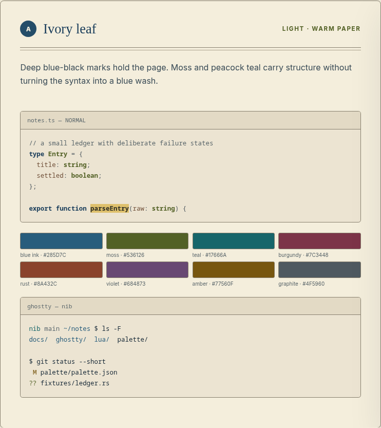
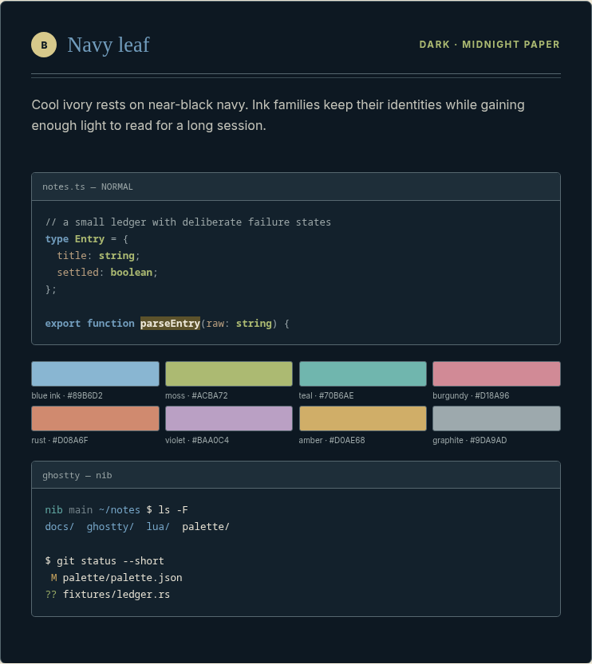
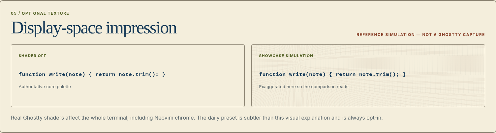

# Nib

Nib is a coordinated light/dark theme family for [Ghostty](https://ghostty.org/) and [Neovim](https://neovim.io/). Its light mode places deep blue-black fountain-pen ink on warm ivory; its dark sibling uses cool ivory ink on near-black navy. Moss leads the non-blue syntax colors, followed by peacock teal, restrained burgundy, rust, violet, amber, sepia, and graphite.

The core themes are opaque, dependency-free, and complete without shaders. No normal foreground or background is pure black or pure white.





These are deterministic browser reference renders, not terminal captures. See the [artifact record](docs/ARTIFACTS.md) for exact tools, dimensions, and reproduction commands.

## Quick start

### Neovim

Put the repository on Neovim's runtime path, then use the automatic entry point:

```lua
vim.o.background = "dark" -- or "light"
vim.cmd.colorscheme("nib")
```

No `setup()` call is required. Explicit entry points are also available:

```vim
:colorscheme nib-light
:colorscheme nib-dark
```

A local-checkout Lazy.nvim specification is:

```lua
{
  dir = vim.fn.expand("~/src/nib"),
  lazy = false,
  priority = 1000,
  config = function()
    require("nib").setup({
      style = "auto",
      transparent = false,
      italics = true,
      terminal_colors = true,
      integrations = {
        -- telescope = false,
      },
    })
  end,
}
```

For a manual package install, copy or symlink the checkout into a `start` directory under Neovim's data path, for example `~/.local/share/nvim/site/pack/themes/start/nib` on Linux. The [Neovim guide](docs/NEOVIM.md) documents loading, options, integrations, semantics, and troubleshooting.

### Ghostty

Preview the safe installer without changing any configuration:

```sh
python3 scripts/install_ghostty.py
```

Install only the two theme files with an explicit action:

```sh
python3 scripts/install_ghostty.py --apply
```

Then add this verified Ghostty 1.3 paired-theme syntax to your own configuration:

```ini
theme = light:nib-light,dark:nib-dark
window-theme = system
background-opacity = 1
```

The installer does not edit `~/.config/ghostty/config`, load a shader, or overwrite an existing theme unless `--force` is explicit. Linux, macOS, symlink, backup, uninstall, tmux, and SSH instructions are in the [Ghostty guide](docs/GHOSTTY.md).

## Setup API

The API intentionally stays small:

```lua
require("nib").setup({
  style = "auto", -- "auto", "light", or "dark"
  transparent = false,
  italics = true,
  terminal_colors = true,
  integrations = {
    -- set a supported integration to false to omit its groups
  },
})
```

`style = "auto"` follows `vim.o.background`. The runtime clears prior highlights before every load, defines terminal colors 0–15 unless disabled, and sets `vim.g.colors_name` to the entry point in use. Transparency affects editor backgrounds; measured contrast applies only to the default opaque surfaces.

Nib defines harmless groups for nvim-treesitter, Telescope, nvim-cmp, Gitsigns, WhichKey, Trouble, Noice, Snacks, and lualine without importing those plugins. Tree-sitter is the dependable syntax baseline. LSP semantic types refine it conservatively, while modifiers emphasize state through weight, underline, italics, or strikethrough rather than server-dependent recoloring.

## Optional static shaders

Two opt-in Ghostty shader chains add procedural paper grain followed by restrained ink feathering. The daily preset is nearly imperceptible; the showcase preset is deliberately stronger. Neither animates, uses external textures, or participates in the default install.

```ini
custom-shader = /absolute/path/to/nib/ghostty/shaders/paper-grain-daily.glsl
custom-shader = /absolute/path/to/nib/ghostty/shaders/ink-feather-daily.glsl
custom-shader-animation = false
```

Ghostty post-processing affects the whole rendered surface, including Neovim chrome. If a shader causes a black surface, remove every `custom-shader = ...` line from another terminal or editor and restart Ghostty. Read the complete [shader guide](docs/SHADERS.md) before opting in.



## Preview laboratory

The static site consumes generated palette CSS and JSON-shaped JavaScript. It has no framework, telemetry, account, CDN, or runtime network dependency:

```sh
make preview
# open http://127.0.0.1:8765/preview/
```

It includes side-by-side modes, six language/specialized samples, semantic swatches, ANSI output, completion and diagnostic UI, diffs, Markdown, selection, search, statuslines, contrast measurements, and color-vision notes. Mode buttons and sample controls are keyboard accessible.

Additional committed renders:

- [ANSI comparison](output/playwright/preview/ansi-comparison-render.png)
- [Syntax detail](output/playwright/preview/syntax-detail-render.png)
- [Shader comparison](output/playwright/preview/shader-comparison-render.png)

## Design and accessibility

One canonical [palette](palette/palette.json), validated by its [schema](palette/schema.json), generates the application palettes, entry points, Ghostty themes, preview data, machine export, contrast table, ANSI table, and color-vision report. Physical inks and external palettes informed relationships only; none supplied an “exact” screen color.

Principal text targets 7:1 contrast where aesthetically reasonable. Meaningful text requires 4.5:1, and relevant boundaries/non-text indicators require 3:1. Comments pass the ordinary-text target in both modes. Protanopia, deuteranopia, and tritanopia simulations are regression-tested, while critical states also use letters, signs, undercurls, weight, strikethrough, or distinct surface tints. These scoped checks are not blanket accessibility certification.

Read the [palette rationale](docs/PALETTE.md), [accessibility report](docs/ACCESSIBILITY.md), and generated [contrast](docs/generated/CONTRAST.md), [ANSI](docs/generated/ANSI.md), and [color-vision](docs/generated/COLOR_VISION.md) tables.

## Supported versions

- Neovim 0.10 or newer. The release suite passes under Neovim 0.10.4 and 0.11.6.
- Ghostty 1.3.0 or newer for automatic paired light/dark selection. Theme validation passes under Ghostty 1.3.1.
- A truecolor terminal is recommended for Neovim. The 16-color Ghostty palette remains intentionally conventional for remote and degraded sessions.

The runtime Lua has no dependencies and performs no network requests. Development checks use Python 3.11 or newer; Node.js, Ghostty, and `glslc` add checks when present as documented in the [development guide](docs/DEVELOPMENT.md).

## Verification

Run the complete local suite:

```sh
make verify
```

It checks the schema, required roles, color format, generation drift, contrast, semantic and ANSI distinguishability, color-vision regressions, Neovim loading/switching/setup behavior, Ghostty structure and runtime validation when installed, shader structure and compilation when `glslc` is installed, preview data and artifacts, fixtures, documentation links, syntax, and `git diff --check`.

## Troubleshooting

- If `:colorscheme nib` is not found, confirm the repository root—not its `lua/` directory—is on `runtimepath`.
- If automatic Neovim mode looks wrong, set `vim.o.background` before invoking the colorscheme or use an explicit entry point.
- If Ghostty cannot find a theme, confirm the files are named exactly `nib-light` and `nib-dark` under `$XDG_CONFIG_HOME/ghostty/themes` or `~/.config/ghostty/themes`.
- If remote colors differ, verify truecolor and terminfo on the remote host; fixed RGB output bypasses the ANSI palette.
- If generated files differ, edit only `palette/palette.json`, then run `make generate` and review every generated change.

## Provenance and licence

Research sources, licences, AI disclosures, reuse status, and non-affiliation are recorded in [THIRD_PARTY_REFERENCES.md](THIRD_PARTY_REFERENCES.md). Nib does not bundle third-party photographs, palette assets, logos, fonts, or brand artwork. Original code and documentation are available under the [MIT License](LICENSE).
